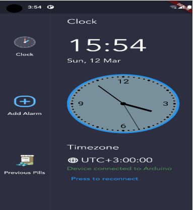
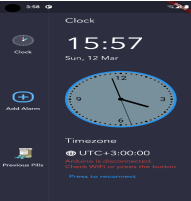
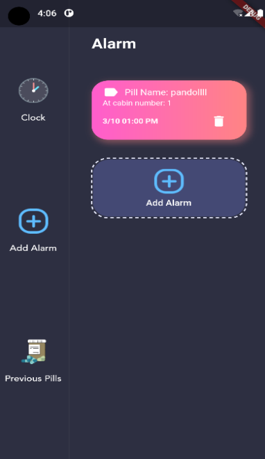
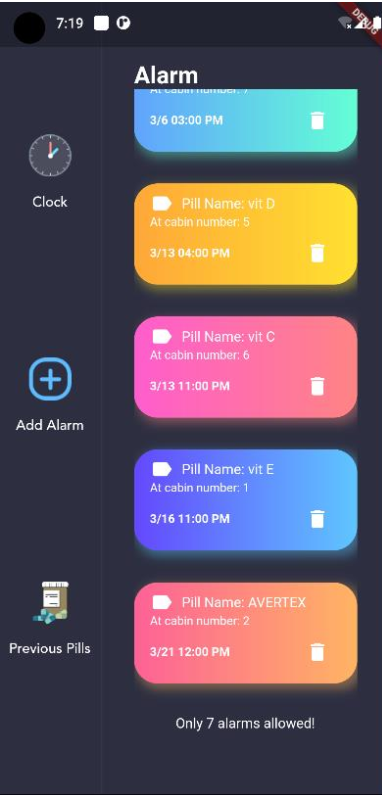
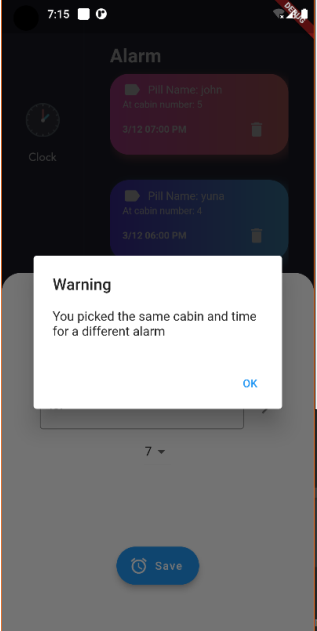
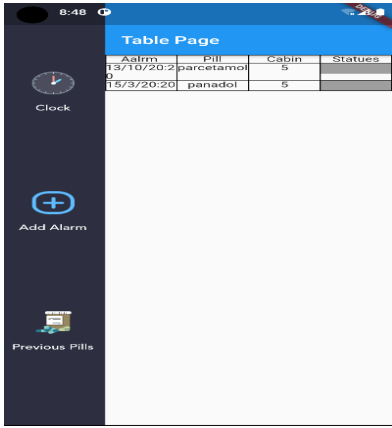

# smartpharm

A new Flutter project.

## Getting Started
A few resources to get you started if this is your first Flutter project:
- [Lab: Write your first Flutter app](https://docs.flutter.dev/get-started/codelab)
- [Cookbook: Useful Flutter samples](https://docs.flutter.dev/cookbook)
make sure to configuer the nodemcu and make sure the app is conected the wifi that esp8266 is broadcasting.  

here are some screenshots from the app:

  

  

  

  

  

